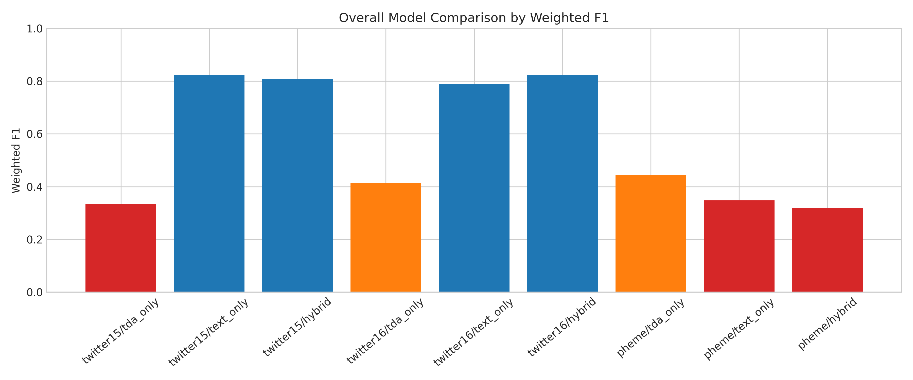
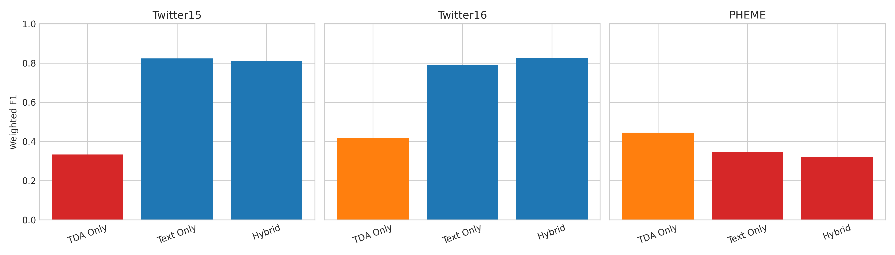
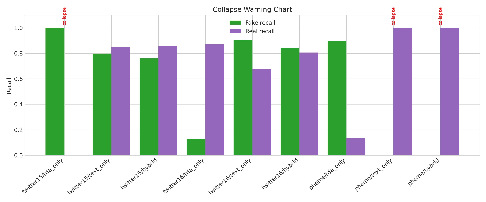
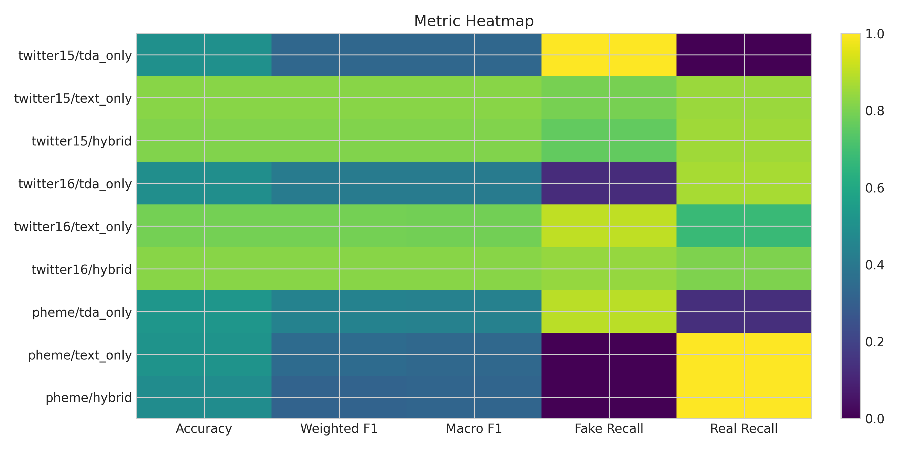

# VeriLogos Rumor Detection

VeriLogos is a research-oriented rumor veracity detection framework that operationalizes a relational-geometric perspective on social-media rumor propagation and textual semantics. The project evaluates three model families on ACL2017 rumor datasets: `tda_only`, `text_only`, and `hybrid`.

The final results and publication package in this repository are frozen from audited artifacts and explicitly separate reliable from collapsed/unreliable runs.

## Problem Statement

Rumor detection on social media requires identifying whether an event is real or fake under noisy, imbalanced, and dataset-dependent conditions. Purely textual or purely structural approaches can fail depending on dataset characteristics.

## Proposed Solution: VeriLogos

VeriLogos combines:

- **Text semantics**: transformer-based representation learning from source tweets.
- **Propagation geometry**: topological and structural signals from rumor propagation trees.
- **Hybrid fusion**: a joint model (`hybrid`) that integrates text and structural features.

This design is motivated by the theoretical perspective in **"Truth as Geometry"** (Alireza Pourmoslemi), where structure and semantics are treated as complementary sources for truth-relevant inference.

## Repository Structure

- `verilogos_rumor_detection/`: runnable rumor-detection project (code, configs, scripts, checkpoint).
- `results/publication_ready_package_20260430_073301/`: frozen audit-ready publication package (tables, figures, claims, recommendations, checklists).
- `results/`: additional experiment summaries and plots.
- `Truth_as_Geometry/`: local theory source corpus used for manuscript framing.

## Final Audited Results (Frozen)

Source: `results/publication_ready_package_20260430_073301/` and `VeriLogos_Final_Export_20260429_201314/` artifacts.

### Best Overall

- `twitter16 / hybrid`: **Weighted F1 = 0.8239**

### Best Per Dataset

- `twitter15 / text_only`: **Weighted F1 = 0.8229**
- `twitter16 / hybrid`: **Weighted F1 = 0.8239**
- `pheme / tda_only`: **Weighted F1 = 0.4447** (weak/diagnostic)

### Reliability Warnings

Collapsed/unreliable runs (excluded from winning scientific claims):

- `twitter15 / tda_only`
- `pheme / text_only`
- `pheme / hybrid`

PHEME remains unstable and must be interpreted conservatively.

## Main Performance Table

| Dataset | Mode | Accuracy | Weighted F1 | Macro F1 | Fake Recall | Real Recall | Collapse |
| --- | --- | ---: | ---: | ---: | ---: | ---: | --- |
| twitter15 | tda_only | 0.5000 | 0.3333 | 0.3333 | 1.0000 | 0.0000 | YES |
| twitter15 | text_only | 0.8230 | 0.8229 | 0.8229 | 0.7965 | 0.8496 | NO |
| twitter15 | hybrid | 0.8097 | 0.8093 | 0.8093 | 0.7611 | 0.8584 | NO |
| twitter16 | tda_only | 0.4960 | 0.4153 | 0.4171 | 0.1270 | 0.8710 | NO |
| twitter16 | text_only | 0.7920 | 0.7892 | 0.7890 | 0.9048 | 0.6774 | NO |
| twitter16 | hybrid | 0.8240 | 0.8239 | 0.8239 | 0.8413 | 0.8065 | NO |
| pheme | tda_only | 0.5263 | 0.4447 | 0.4389 | 0.8974 | 0.1351 | NO |
| pheme | text_only | 0.4868 | 0.3188 | 0.3274 | 0.0000 | 1.0000 | YES |
| pheme | hybrid | 0.4868 | 0.3188 | 0.3274 | 0.0000 | 1.0000 | YES |

## Key Figures

### Overall Model Comparison



### Per-Dataset Weighted F1



### Collapse Warning Chart



### Metric Heatmap



## Installation

### Local (Python 3.10+)

```bash
cd verilogos_rumor_detection
python -m venv .venv
source .venv/bin/activate  # Windows: .venv\Scripts\activate
pip install -r requirements.txt
```

### Colab

Use either:

- `verilogos_rumor_detection/Run_on_Colab.ipynb`
- `results/publication_ready_package_20260430_073301/Run_on_Colab.ipynb`

## Dataset Layout

Expected layout for ACL2017 data:

```text
data/acl2017/
  twitter15/
    label.txt
    source_tweets.txt
    tree/
  twitter16/
    label.txt
    source_tweets.txt
    tree/
```

PHEME handling and caveats are documented in:

- `results/publication_ready_package_20260430_073301/DECISION_PHEME_TEXT_ONLY_UNRESOLVED.md`
- `results/publication_ready_package_20260430_073301/publication_package_audit.json`

## Run Inference / Experiments

```bash
cd verilogos_rumor_detection
python run.py --mode tda_only  --data_path ./data/acl2017
python run.py --mode text_only --data_path ./data/acl2017
python run.py --mode hybrid    --data_path ./data/acl2017
```

Useful overrides:

```bash
python run.py --mode hybrid --data_path ./data/acl2017 --max_events 200 --epochs 5
```

## Reproduce Frozen Reporting Outputs

The frozen publication outputs are already stored and should not be recomputed for claim changes:

- `PUBLICATION_READY_EXECUTIVE_SUMMARY.md`
- `publication_tables.{md,csv,tex}`
- `FIGURE_PLAN.md`
- `figures_manifest.json`
- `FINAL_RECOMMENDED_MODELS.{md,json}`
- `FINAL_RECOMMENDED_CONFIGS.{md,json}`
- `FINAL_TUNING_RECOMMENDATION.md`
- `PAPER_READY_CLAIMS.md`
- `SUBMISSION_CHECKLIST.md`
- `AUDIT_ONLY_PUBLICATION_REVIEW.{md,json}`

All are under:

- `results/publication_ready_package_20260430_073301/`

## Why VeriLogos Works (Research Hypothesis)

VeriLogos assumes rumor veracity signals are distributed across:

- **semantic content** (what is claimed), and
- **relational/geometric diffusion patterns** (how claims propagate).

On ACL2017 Twitter datasets, text-aware models are strongest overall, while topology contributes dataset-dependent signal and remains valuable for analysis and diagnostics. On PHEME, instability indicates this hypothesis is not uniformly validated across datasets.

## Reproducibility Notes

- Frozen package checksum file: `results/publication_ready_package_20260430_073301/SHA256SUMS.txt`
- Final package manifest: `results/publication_ready_package_20260430_073301/PACKAGE_MANIFEST.md`
- Audit report: `results/publication_ready_package_20260430_073301/publication_package_audit.json`

## Citation

If you use this repository, cite:

- VeriLogos project artifacts in this repository.
- Theory framing: *Truth as Geometry* (Alireza Pourmoslemi).

## License

This repository is distributed under the MIT License. See `LICENSE`.
